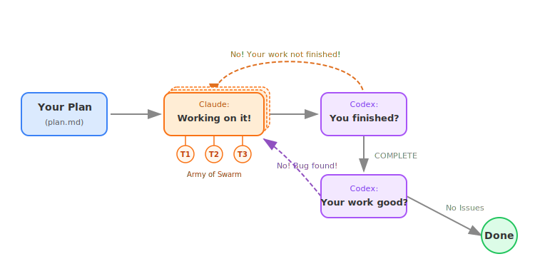

# Humanize

Rust implementation of the Humanize workflow for iterative development with independent Codex review.

Chinese version: [README_ZH.md](./README_ZH.md)

## Project Origin

This repository is a Rust rewrite of the original Humanize project:

- Original project: <https://github.com/humania-org/humanize/tree/main>

The workflow model remains compatible, but the implementation and runtime orchestration are now handled by Rust.

## Overview

Humanize provides three main workflow families:

- `RLCR`: iterative implementation plus Codex review
- `PR loop`: review-bot tracking and validation for pull requests
- `ask-codex`: one-shot Codex consultation

## Workflow

RLCR workflow overview:



State is stored under `.humanize/` in the working project:

- `.humanize/rlcr/`
- `.humanize/pr-loop/`
- `.humanize/skill/`

## Architecture

Humanize is now organized as one shipped runtime plus one external backend:

1. `humanize` binary
   The Rust runtime engine. It embeds the prompt templates and owns all loop, hook, validation, monitor, and Codex orchestration logic.
2. Codex CLI
   The review backend used by RLCR, PR validation, and `ask-codex`.

There is no separate Codex-host or Kimi-host installation path anymore.
Codex is kept only as the independent reviewer backend.

## Repository Layout

- `crates/core`: shared state, filesystem, git, codex, and template logic
- `crates/cli`: the `humanize` executable
- `prompt-template/`: source prompt templates embedded into the binary
- `skills/`: host-installed `SKILL.md` files for Claude Code and Droid
- `hooks/`: host hook configuration pointing to `humanize` on `PATH`
- `commands/`: host slash-command definitions
- `agents/`: Claude agent definitions and Droid droid source definitions
- `.claude-plugin/`: legacy plugin metadata kept for compatibility
- `docs/`: installation and usage docs

## Runtime Assets

### Prompt Templates

Prompt templates live under `prompt-template/`:

- `prompt-template/block/`
- `prompt-template/claude/`
- `prompt-template/codex/`
- `prompt-template/plan/`
- `prompt-template/pr-loop/`

The `humanize` binary embeds these templates.
The top-level `prompt-template/` directory is the source of truth for development and maintenance.

### Host Skills

Source skill definitions live under `skills/`:

- `skills/ask-codex/SKILL.md`
- `skills/humanize/SKILL.md`
- `skills/humanize-gen-plan/SKILL.md`
- `skills/humanize-rlcr/SKILL.md`

These skills are installed into the host by `humanize init`.

## Installation

The recommended model is:

1. install `humanize` on `PATH`
2. install `codex` on `PATH`
3. install Humanize into the host

### 1. Install `humanize` on `PATH`

From crates.io:

```bash
cargo install humanize-cli --bin humanize
```

From this repository:

```bash
cargo install --path crates/cli --bin humanize
```

Or build a release binary and place it on `PATH` manually:

```bash
cargo build --release
cp target/release/humanize /usr/local/bin/humanize
```

Verify:

```bash
which humanize
humanize --help
```

### 2. Install Codex CLI

Humanize uses Codex as an independent reviewer backend.
Install Codex CLI separately and make sure `codex` is on `PATH`.

Verify:

```bash
codex --version
```

### 3. Install into the Host

Claude Code:

```bash
humanize init --global
# or non-interactive:
humanize init --global --auto-patch
```

This installs into `~/.claude/`:

- `commands/` as global `/humanize-*` slash commands
- `agents/`
- `skills/`
- Humanize hook registrations merged into `~/.claude/settings.json`

Validate:

```bash
humanize init --global --show
```

Droid:

```bash
humanize init --global --target droid
# or non-interactive:
humanize init --global --target droid --auto-patch
```

This installs into `~/.factory/`:

- `commands/`
- `droids/`
- `skills/`
- Humanize hook registrations merged into `~/.factory/settings.json`

Validate:

```bash
humanize init --global --target droid --show
```

The `humanize` executable still comes from `PATH`.
Legacy plugin installation metadata remains in the repository for compatibility, but `humanize init` is now the primary installation path.

## Local Development

Inspect the CLI:

```bash
humanize --help
humanize setup rlcr --help
humanize setup pr --help
humanize monitor rlcr --help
```

If `humanize` is not installed on `PATH` yet, you can temporarily replace these examples with `cargo run -- ...` while developing locally.

## Using Humanize in the Host

Once Humanize is installed in Claude Code or Droid, the primary user interface is the host REPL, not the raw CLI.
The host-side commands, skills, and hooks call `humanize` behind the scenes.

With `humanize init`, both hosts expose the same `/humanize-*` slash commands.
`ask-codex` remains available as a skill.

### Quick Start

Claude Code:

```bash
/humanize-gen-plan --input draft.md --output docs/plan.md
/humanize-start-rlcr-loop docs/plan.md
/humanize-resume-rlcr-loop
/humanize-start-pr-loop --claude
/humanize-resume-pr-loop
/humanize-cancel-rlcr-loop
/ask-codex Explain the latest review result
```

Droid:

```bash
/humanize-gen-plan --input draft.md --output docs/plan.md
/humanize-start-rlcr-loop docs/plan.md
/humanize-resume-rlcr-loop
/humanize-start-pr-loop --claude
/humanize-resume-pr-loop
/humanize-cancel-rlcr-loop
/ask-codex Explain the latest review result
```

Both hosts expose the same workflow families:

- generate a plan from a draft
- start an RLCR loop
- resume an existing RLCR loop from `.humanize/`
- start a PR loop
- resume an existing PR loop from `.humanize/`
- cancel an active RLCR or PR loop
- consult Codex directly

### What The Host Install Does For You

- Hooks call the native Rust validators and stop hooks automatically.
- RLCR and PR loop state is persisted under `.humanize/`.
- Bundled skills such as `humanize`, `humanize-rlcr`, `humanize-gen-plan`, and `ask-codex` are available to the host and may be auto-invoked when relevant.

### RLCR User Flow

1. In Claude Code or Droid, run `/humanize-gen-plan --input draft.md --output docs/plan.md`.
2. Run `/humanize-start-rlcr-loop docs/plan.md`.
3. Continue working normally in the host.
4. When the host stops, Humanize hooks automatically validate state, run Codex review, and decide whether to continue, block, or advance the phase.
5. Use the monitor from a terminal if you want a live view of the loop state.

If the host session is lost but `.humanize/rlcr/` still exists, resume the loop instead of starting over:

- `/humanize-resume-rlcr-loop`

### Direct CLI Usage

Direct CLI usage is mainly for:

- monitor dashboards
- debugging
- manual recovery
- non-hook environments

Examples:

```bash
humanize gen-plan --input draft.md --output docs/plan.md
humanize setup rlcr docs/plan.md
humanize resume rlcr
humanize gate rlcr
humanize resume pr
humanize ask-codex "Explain the latest review result"
```

### Monitor

One-shot snapshot:

```bash
humanize monitor rlcr --once
humanize monitor pr --once
humanize monitor skill --once
```

Interactive TUI:

```bash
humanize monitor rlcr
humanize monitor pr
humanize monitor skill
```

TUI controls:

- `q` / `Esc`: quit
- `j` / `k` or arrow keys: scroll
- `PgUp` / `PgDn`: page scroll
- `g` / `G`: top / bottom
- `f`: toggle follow mode
- `r`: refresh immediately

Example RLCR monitor TUI:


### Manual Recovery / Hook Debugging

Direct stop invocation:

```bash
printf '{}' | humanize stop rlcr
printf '{}' | humanize stop pr
```

Skill-mode or non-hook gate:

```bash
humanize gate rlcr
```

Gate exit codes:

- `0`: allowed
- `10`: blocked
- `20`: runtime / infrastructure error

## Manual Hook Testing

Example: read validator

```bash
printf '%s\n' '{"tool_name":"Read","tool_input":{"file_path":"src/main.rs"}}' \
  | humanize hook read-validator
```

Example: bash validator

```bash
printf '%s\n' '{"tool_name":"Bash","tool_input":{"command":"git add -A"}}' \
  | humanize hook bash-validator
```

## Prompt / Skill Maintenance

Update prompt templates in `prompt-template/`.

Examples:

- `prompt-template/claude/next-round-prompt.md`
- `prompt-template/codex/full-alignment-review.md`
- `prompt-template/pr-loop/round-0-task-has-comments.md`

Update host asset sources in:

- `skills/`
- `hooks/`
- `commands/`
- `agents/`
- `.claude-plugin/`

Then rerun `humanize init --global` for the host you use.

## Additional Documentation

- [docs/usage.md](./docs/usage.md)
- [docs/install-for-claude.md](./docs/install-for-claude.md)
- [docs/install-for-droid.md](./docs/install-for-droid.md)
- [docs/install-for-codex.md](./docs/install-for-codex.md)

## Build

```bash
cargo build
cargo test
```

## License

MIT
