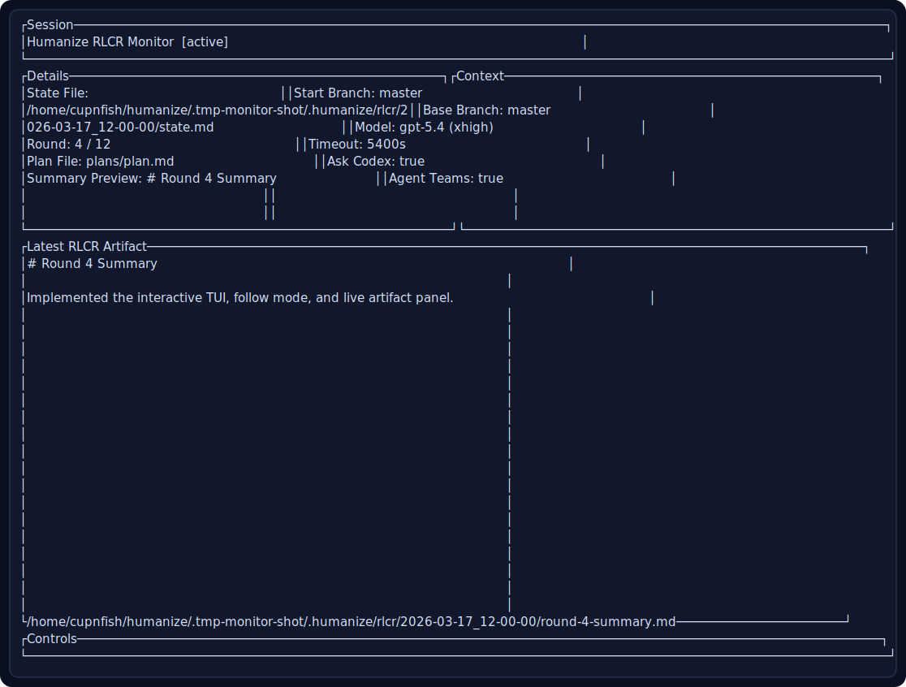

# Humanize

Humanize 的 Rust 版本仓库说明。

English version: [README.md](./README.md)

## 项目来源

本仓库是对原始 Humanize 项目的 Rust 重写：

- 原项目：<https://github.com/humania-org/humanize/tree/main>

## 概览

Humanize 提供三类核心能力：

- `RLCR`：实现循环 + Codex review
- `PR loop`：PR review bot 跟踪与验证
- `ask-codex`：一次性 Codex 咨询

运行时状态保存在项目目录下的 `.humanize/`：

- `.humanize/rlcr/`
- `.humanize/pr-loop/`
- `.humanize/skill/`

## 仓库结构

- `crates/core`：状态、文件、git、codex、模板等核心逻辑
- `crates/cli`：`humanize` 可执行文件
- `prompt-template/`：运行时提示词模板
- `skills/`：源 `SKILL.md`
- `hooks/`：原生 hook 配置
- `commands/`：命令定义
- `agents/`：辅助 agent 定义
- `docs/`：安装与使用文档
- `shims/`：可选兼容 shim

## 安装方式

推荐顺序：

1. 先把 `humanize` 安装到 `PATH`
2. 再安装运行时 assets
3. 需要的话再安装 skills

### 1. 安装 `humanize`

```bash
cargo install --path .
```

或手动把 release binary 放到 `PATH`：

```bash
cargo build --release
cp target/release/humanize /usr/local/bin/humanize
```

验证：

```bash
which humanize
humanize --help
```

### 2. 安装运行时 assets

```bash
cargo run -- install --plugin-root "$PWD"
```

这个步骤会同步：

- `prompt-template/`
- `hooks/`
- `commands/`
- `agents/`
- `skills/`
- `.claude-plugin/`

不会复制 binary。
binary 必须已经在 `PATH` 上。

### 3. 安装 skills

Codex:

```bash
cargo run -- install-skills --target codex
```

Kimi:

```bash
cargo run -- install-skills --target kimi
```

安装后的 skill 默认假定 `humanize` 已经在 `PATH` 上。

## 本地开发

```bash
export CLAUDE_PLUGIN_ROOT="$PWD"
export CLAUDE_PROJECT_DIR="$PWD"
```

## 常用命令

### 生成计划

```bash
cargo run -- gen-plan --input draft.md --output docs/plan.md
```

### 启动 RLCR

```bash
cargo run -- setup rlcr docs/plan.md
```

### RLCR Gate

```bash
cargo run -- gate rlcr
```

### 启动 PR Loop

```bash
cargo run -- setup pr --claude
cargo run -- setup pr --codex
```

### Ask Codex

```bash
cargo run -- ask-codex "Explain the latest review result"
```

### Monitor

快照模式：

```bash
cargo run -- monitor rlcr --once
```

TUI 模式：

```bash
cargo run -- monitor rlcr
```

示例监控界面：



## 提示词和 Skill 在哪里

- 提示词模板：`prompt-template/`
- skill 源文件：`skills/`

改完模板或 skill 后，重新执行 `install` / `install-skills` 即可。

## 其他文档

- [docs/usage.md](./docs/usage.md)
- [docs/install-for-claude.md](./docs/install-for-claude.md)
- [docs/install-for-codex.md](./docs/install-for-codex.md)
- [docs/install-for-kimi.md](./docs/install-for-kimi.md)
