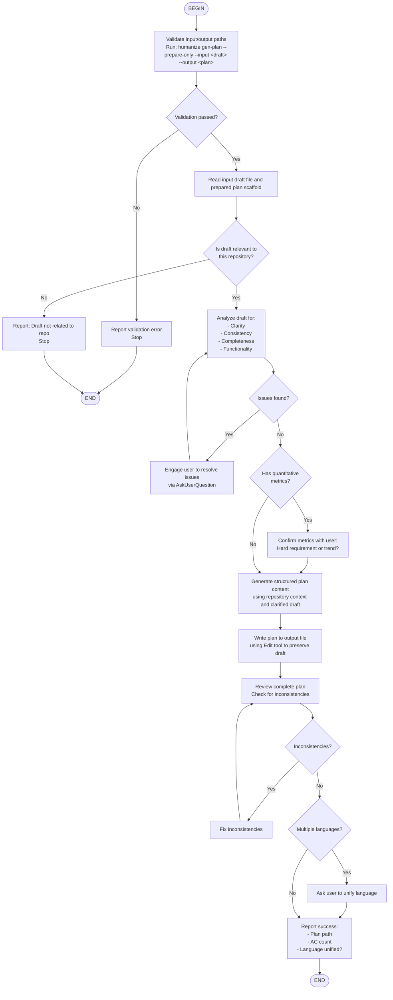

# Humanize Generate Plan

Transforms a rough draft document into a well-structured implementation plan with clear goals, acceptance criteria (AC-X format), path boundaries, and feasibility suggestions.

## Runtime Command

All command examples below use the `humanize` CLI available on `PATH`:

```bash
humanize
```

## Workflow



## Required Sequence

### 1. Validate and Prepare

Run the CLI in scaffold mode:

```bash
humanize gen-plan --prepare-only --input <path/to/draft.md> --output <path/to/plan.md>
```

This step should:
- validate input and output paths
- create the output file from the embedded plan template
- append the original draft under `--- Original Design Draft Start ---`

If this command exits non-zero, stop and report the error directly.

### 2. Check Repository Relevance

After scaffold creation succeeds:

1. Read the draft file
2. Use the Task tool to invoke the `humanize:draft-relevance-checker` agent
3. If the result is not relevant, report that and stop

### 3. Analyze the Draft

Analyze the draft for:
- clarity
- consistency
- completeness
- functionality

Use repository exploration where needed to understand affected code paths and dependencies.

### 4. Resolve Ambiguities

If issues are found:
- use AskUserQuestion to resolve them
- preserve the original draft content
- treat answers as additive clarifications, not replacements

For quantitative metrics:
- explicitly ask whether each metric is a **hard requirement** or a **trend / optimization direction**

### 5. Generate Plan Content

Generate plan content that includes:
- goal description
- acceptance criteria with positive and negative tests
- path boundaries
- feasibility hints
- dependencies and milestones
- implementation notes

The generated plan must preserve all meaningful information from the original draft plus all clarifications.

### 6. Update the Prepared Output File

Use the Edit tool to update the prepared output file:
- replace template placeholders with the generated plan
- keep the original draft section intact at the bottom
- review the full file for consistency

### 7. Optional Language Unification

If the resulting plan mixes languages:
- ask the user whether to unify the language
- if yes, translate while preserving meaning and structure

## Validation Exit Codes

`humanize gen-plan --prepare-only` uses these exit codes:

| Exit Code | Meaning |
|-----------|---------|
| 0 | Success - continue |
| 1 | Input file not found |
| 2 | Input file is empty |
| 3 | Output directory does not exist |
| 4 | Output file already exists |
| 5 | No write permission |
| 6 | Invalid arguments |
| 7 | Plan template file not found |

## Important Note

The full `humanize gen-plan` command still exists for terminal-only workflows, but inside Claude Code the preferred behavior is this host-driven flow:
- CLI for deterministic validation and scaffold preparation
- host reasoning for analysis, clarification, and final authoring
