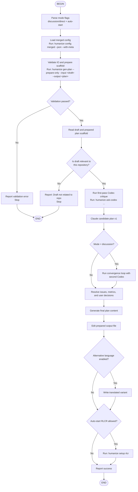

# Humanize Generate Plan

Transforms a rough draft document into a well-structured implementation plan with clear goals, acceptance criteria (AC-X format), path boundaries, and feasibility suggestions.

## Runtime Command

All command examples below use the `humanize` CLI available on `PATH`:

```bash
humanize
```

## Workflow



## Required Sequence

### 1. Parse Mode Flags

Read command arguments and determine:
- `GEN_PLAN_MODE=discussion` or `direct`
- whether `--auto-start-rlcr-if-converged` is enabled

Reject simultaneous `--discussion` and `--direct`.

### 2. Load Merged Config

Run:

```bash
humanize config merged --json --with-meta
```

Use the returned JSON to resolve:
- `alternative_plan_language`
- `gen_plan_mode`
- deprecated `chinese_plan` fallback

CLI flags take priority over config.

### 3. Validate and Prepare

Run:

```bash
humanize gen-plan --prepare-only --input <path/to/draft.md> --output <path/to/plan.md>
```

This step should:
- validate input and output paths
- create the output file from the embedded plan template
- append the original draft under `--- Original Design Draft Start ---`

If this command exits non-zero, stop and report the error directly.

### 4. Check Repository Relevance

After scaffold creation succeeds:

1. Read the draft file
2. Use the Task tool to invoke the `humanize:draft-relevance-checker` agent
3. If the result is not relevant, report that and stop

### 5. Run Codex First-Pass Analysis

Consult Codex with:

```bash
humanize ask-codex "<structured planning critique prompt>"
```

The response should identify:
- core risks
- missing requirements
- technical gaps
- alternative directions
- questions for the user
- candidate acceptance criteria

Use this output as **Codex Analysis v1**.

### 6. Build Candidate Plan v1

Using the draft, repo context, and Codex Analysis v1:
- produce a candidate plan
- identify planning issues
- summarize scope, dependencies, and risks

### 7. Run Convergence in Discussion Mode

If `GEN_PLAN_MODE=discussion`:
- run a second `humanize ask-codex` pass to challenge the candidate plan
- revise the plan
- repeat until converged, no material progress is being made, or 3 rounds are reached

If `GEN_PLAN_MODE=direct`:
- skip convergence rounds
- mark the plan as partially converged

### 8. Resolve Ambiguities and User Decisions

Use AskUserQuestion to resolve:
- planning issues
- quantitative metrics that need hard vs trend classification
- unresolved Claude vs Codex disagreements

Preserve the original draft content. Treat user answers as additive clarifications, not replacements.

### 9. Generate Final Plan Content

The final plan must include:
- goal description
- acceptance criteria with positive and negative tests
- path boundaries
- feasibility hints
- dependencies and milestones
- implementation notes
- Claude-Codex deliberation summary
- pending user decisions section

### 10. Update the Prepared Output File

Use the Edit tool to update the prepared output file:
- replace template placeholders with the generated plan
- keep the original draft section intact at the bottom
- review the full file for consistency

### 11. Optional Translation Variant

If alternative language output is enabled:
- write a translated variant beside the main plan file
- preserve technical identifiers and structure

### 12. Optional Auto-Start

If `--auto-start-rlcr-if-converged` is enabled, only auto-start when:
- mode is `discussion`
- convergence status is `converged`
- no pending user decisions remain

Run:

```bash
humanize setup rlcr <path/to/plan.md>
```

### 13. Report Results

Report:
- plan path
- convergence status
- translation status
- auto-start status
- any remaining unresolved decisions

## Validation Exit Codes

`humanize gen-plan --prepare-only` uses these exit codes:

| Exit Code | Meaning |
|-----------|---------|
| 0 | Success - continue |
| 1 | Input file not found |
| 2 | Input file is empty |
| 3 | Output directory does not exist |
| 4 | Output file already exists |
| 5 | No write permission |
| 6 | Invalid arguments |
| 7 | Plan template file not found |

## Important Note

Inside Claude Code, this skill is the preferred `gen-plan` path:
- the host owns the multi-phase planning conversation
- `humanize` CLI replaces the legacy shell helpers
- `humanize ask-codex` remains a one-shot consultation tool used by the host flow rather than the top-level orchestrator
